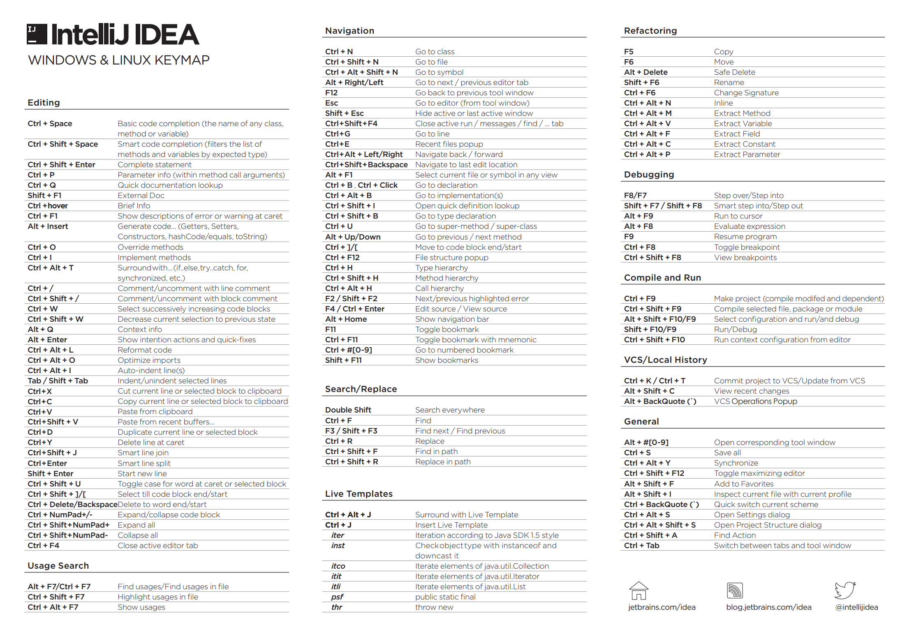

# notion

### idea

| key        | value                |
| ---------- | -------------------- |
| ctrl+alt+l | 调整格式             |
| ctrl + p   | 方法参数提示         |
| ctrl + b   | 查看方法在本地的实现 |
| ctrl+alt+b | 查看所有实现类       |
| ctrl + q   | 提示信息             |
| alt + 7    | 查看某类所有方法     |

https://zhuanlan.zhihu.com/p/61690346

