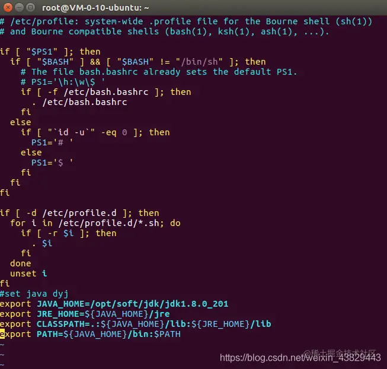

[TOC]

## Linux

> 非安装包安装


### 1. JDK

https://juejin.cn/post/7031523681058684942 

#### 1.1 查看安装位置，是否有安装

```bash
# 查看安装位置
sudo update-alternatives --config java
```

#### 1.2 安装

```环境
sudo apt-get update
sudo apt-get install openjdk-8-jdk
java --version
```

#### 1.3 设置环境变量

```bash
sudo vim /etc/profile
```

```Bash
export JAVA_HOME=/usr/lib/jvm/java-8-openjdk-amd64
export JRE_HOME=${JAVA_HOME}/jre
export CLASSPATH=.:${JAVA_HOME}/lib:${JRE_HOME}/lib
export PATH=${JAVA_HOME}/bin:$PATH
```

```bash
sudo source /etc/profile
```




### 2. Maven

```Bash
sudo apt install maven
sudo chmod 777 /usr/share/maven/conf/settings.xml
sudo vim /usr/share/maven/conf/settings.xml

sudo vim /etc/profile
export MAVEN_HOME=/usr/share/maven
export PATH=${MAVEN_HOME}/bin:${PATH}
source /etc/profile
```

#### 2.1 setting.xml

改本地仓库位置和镜像源

```xml
<settings xmlns:xsi="http://www.w3.org/2001/XMLSchema-instance" xmlns="http://maven.apache.org/SETTINGS/1.2.0"
          xsi:schemaLocation="http://maven.apache.org/SETTINGS/1.2.0 https://maven.apache.org/xsd/settings-1.2.0.xsd">
    <localRepository>C:\env\apache-maven-repo</localRepository>
    <pluginGroups>
    </pluginGroups>
    <proxies>
    </proxies>
    <servers>
    </servers>
    <mirrors>
        <mirror>
            <id>aliyunmaven</id>
            <mirrorOf>central</mirrorOf>
            <name>aliyun maven</name>
            <url>https://maven.aliyun.com/repository/public</url>
        </mirror>
    </mirrors>
    <profiles>
    </profiles>
</settings>
```


### 3. Git

```Bash
git config --global user.name "cvknop"
git config --global user.email "hj@travelsky.com.cn"
git config --global core.autocrlf false #关闭自动换行的设置
git config --global core.editor vim #设置git操作文件时使用的编辑软件
```

#### 3.1 gen ssh 

```bash
ssh-keygen -t rsa -C 'hj@travelsky.com.cn'
```

